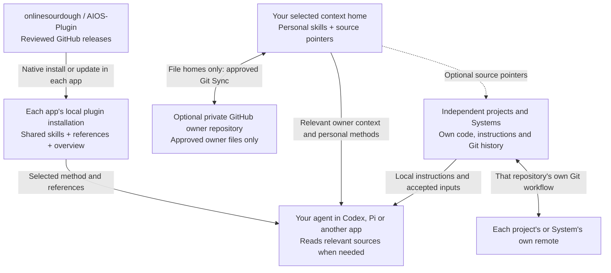

# AIOS

**Business first. Productivity built in.**

AIOS helps your AI assistant plan work, build it, review the result and remember
useful decisions. Install it in the app you use. The same 25 skills work from
one shared source, with native packaging for Codex, Pi, Claude Code, Gemini CLI,
Copilot CLI and Cursor.

Small requests stay small. Larger tasks get a clear outcome, the relevant
specialist method and a review before delivery. Your app still provides the
models, tools and permissions.

AIOS supports business work, decisions, content, design and practical automation.
Its code guidance and verification stay proportional to the task. Projects own
their source, engineering standards, design and delivery configuration.

Projects can be content, research, learning, business work or software. Create
Project establishes the useful workspace and context; Git and GitHub are
optional. Small coding work stays direct with Write Code and the shared Spec,
Build and Review. None of this requires a particular sidebar or execution
environment.

[Factory](https://github.com/arcitai/factory) is a separate package of
engineering methods for T3 Code and native coding agents: Foundation, AgentOps
and the ADLC methods such as implement and review. AIOS and Factory are
independent; neither depends on nor installs the other. The project carries its
accepted scope and relevant sources between them, while the selected environment
owns tools, access and execution protection.

AIOS 0.28.0 retires its Project Foundation skill. To prepare a new or existing
software project for reliable engineering, use
[Factory Foundation](https://github.com/arcitai/factory/tree/main/foundation/factory-foundation)
directly in Codex or Claude; T3 Code is not required for that. AIOS does not
install it or copy its content. Without a selected foundation method, AIOS
reports the gap instead of improvising one.

## Understand complex topics

[Clarify](skills/clarify/SKILL.md) explains a difficult topic or decision from
your question and knowledge level. It uses a concrete example and a visual
when seeing a relationship helps. Ordinary explanations stay in the conversation;
a diagram, interactive visual or reusable file is selected only when useful.

## Agentic systems and skill chains

An agentic system brings together **context, a chain of skills, project files
and tools the agent can operate**. Skills guide the work and pass useful results
to each other. The project holds the brief, sources, working files and reviewed
outputs. A workbench adds a visual production environment when the task needs it.

AIOS includes the Agentic Content System and Agentic Design System as connected
methods in this plugin. You work with them in your existing Codex task and
workspace. The agent selects the relevant steps; a small request does not need
a full production process or an external editor.

### Agentic Content System

From an idea or source material to useful, reviewed content and its adaptations:

**Intent and sources → [Content](skills/content/SKILL.md) +
[Human Writing](skills/human-writing/SKILL.md) → production →
[final content review](skills/content/references/final-review.md) →
[authorized delivery](skills/aios-ship-work/SKILL.md).**

Content owns the audience, angle, evidence, voice, production and reuse. Working
material lives in the project's `content/` folder when needed. A substantial
production can track sources, transcripts, a master and derivatives; each final
piece is reviewed for its own purpose. A short article can remain a simple file.

[Diffusion Studio](skills/diffusion-studio/SKILL.md) is the optional video
workbench: recorded video editing, cuts, audio, captions, overlays and export.
Its role in the content system parallels OpenPencil's role in the design system.
The selected video workflow uses the reviewed external application and its
agent interface. Writing and editorial work need no Studio installation.
AIOS includes the operating skill and helper; the editor is installed separately
when authorized and needed. Final export inspection remains part of content review.

### Agentic Design System

From the intended experience to a visual direction, selected previews and
implementation-ready assets:

**Brief and references → [Design](skills/design/SKILL.md) →
[Review Design](skills/review-design/SKILL.md) →
[implementation](skills/aios-build-work/SKILL.md) when requested.**

The project's `DESIGN.md` holds the visual direction. Its `design/` folder can
hold browser previews, assets and editable companions. Review checks the actual
selected result against the brief, including relevant responsive and interaction
states. An accepted direction can be used by implementation or content production.

For a visual revision, [before/after comparison](skills/design/references/before-after.md)
can make the change inspectable using a genuine baseline and comparable views.
Review checks the claimed improvement and relevant regressions. Existing tools
capture the evidence; no new upload service or automatic PR process is required.

[OpenPencil Workbench](skills/openpencil-workbench/SKILL.md) is the optional
visual editing environment. The agent can open a project companion, work on its
canvas, save and reopen a candidate, and inspect native exports through the
supported workflow. A portable design direction or HTML preview also works
without OpenPencil. Its external runtime is separate from the AIOS plugin.

### Workbenches and the built-in browser

Codex remains the place where you direct the work. Agent-native software gives
the agent a supported interface for operating an external tool, while a browser
view lets you inspect or work with the result in the same workspace. Each tool
keeps its own editing, saving and export capabilities.

| Surface | What happens directly in Codex's built-in browser | Where production happens |
| --- | --- | --- |
| Browser-ready design or application preview | Open a local preview, inspect layouts and test relevant interactions | The agent changes project files and checks the rendered result |
| OpenPencil workbench | Open the returned local workbench URL; view and operate the canvas through the supported browser workflow | The external OpenPencil runtime edits a working copy; reviewed candidates and exports return to the project |
| Diffusion Studio companion | Open the returned one-time local URL for human inspection of supported scene previews, with playback and scrubbing | The agent edits and exports through the external desktop host and its native interface; the browser companion is read-only |

The current Diffusion Studio browser companion does not support media elements,
so it is not a complete video-editing or final-export review surface. Use the
actual export for final video inspection. The [Studio operation guide](skills/diffusion-studio/references/operation.md)
records the supported boundary. A browser view alone never proves a save,
export or reviewed result. In another supported app, use its available browser
surface; browser controls and downloads depend on that app's capabilities.

For example, one content task can combine an article, a short video and a visual
asset. Content owns the message and production; Design supplies the visual
direction; the relevant workbench is selected for the needed artifact. Files
and review stay with that project, and accepted decisions carry between skills.

### Understanding, delivery and setup

The domain systems use these shared skill chains. Arrows show the next relevant
step, not a requirement to repeat work or use every skill.

| What you want to do | Skills and handoffs | What you get |
| --- | --- | --- |
| Think through an idea, agent or automation | [Interview](skills/aios-interview/SKILL.md) → [Spec](skills/aios-spec-work/SKILL.md) when execution needs a contract | Shared understanding, challenged assumptions, decisions and a useful next action |
| Complete substantive work | Spec → [Build](skills/aios-build-work/SKILL.md) → [Review](skills/aios-review-work/SKILL.md) → Ship for authorized delivery | A defined outcome, implemented result, current verification and delivery readback |
| Start a project for content, learning, business or software | [Create Project](skills/aios-create-project/SKILL.md) → the relevant work methods | A useful workspace, context and simple structure; Git and templates are optional |
| Set up or move your AIOS home | [Setup](skills/aios-setup/SKILL.md) leads onboarding through the chosen [Context](skills/aios-context/SKILL.md) procedure, using Maintain Context and Check where needed | A usable home, relevant context, verified chosen connections and a first useful result |
| Keep useful context current | Maintain Context → the selected provider; [Git Sync](skills/aios-maintain-context/references/sync.md) only for an explicitly selected managed AIOS file home | Relevant facts and source pointers; optional scoped backup or restore |
| Create or change a skill | [Manage Skills](skills/aios-manage-skills/SKILL.md) → native authoring or installation → verification, using Check for discovery when relevant | One maintained capability with a known source, placement and recovery path |
| Update or recover a package or specialist | [Update](skills/aios-update/SKILL.md) → native adoption or specialist maintenance → Check where applicable | A selected revision with observed installation state and a recovery route |

Interview starts when requested, or when material uncertainty at the start makes
the direction unclear. A new project or agent alone does not trigger it. During
execution, the assistant asks the necessary question and continues; a broader
interview waits for an appropriate opening. Setup and Spec reuse accepted answers.

When you think aloud, Interview can first restate your goal and the underlying
problem in its own words, then resolve the few questions that change the next
action. You can ask for just that understanding. For an unresolved solution
choice, Spec can select a [small local trial](skills/aios-spec-work/references/local-trials.md):
design variations on a chosen canvas/preview, a runnable UI interaction, or a
sample workflow. Clear work proceeds directly; neither step is a fixed ritual.

Setup replaces `aios-onboard` with the canonical name `aios-setup`. Update explicit
shortcuts and callers when adopting this version. Existing homes resume from
known facts without another foundation interview; owner formats are unchanged.
Final content review and continuity Sync are procedures within their owning
skills, not additional public skills.

### Methods used across systems

| Skill | When it contributes |
| --- | --- |
| [AIOS](skills/aios/SKILL.md) | Selects relevant owner context and methods; independent repositories start with local instructions |
| [Write Code](skills/write-code/SKILL.md) | Supplies implementation and review criteria for code of any size, including scripts and automation |
| Human Writing | Drafts or revises prose directly, or supports another method's writing |
| [Select Model](skills/aios-select-model/SKILL.md) | Assesses model and reasoning suitability when the remaining work warrants it |
| [Orchestrate Workers](skills/aios-orchestrate-workers/SKILL.md) | Coordinates a justified delegation while the caller retains acceptance |
| [Risky Changes](skills/aios-risky-changes/SKILL.md) | Adds representative proof and recovery planning when real-world consequences warrant them |
| [Triage Improvement](skills/aios-triage-improvement/SKILL.md) | Turns a concrete underlying problem into a scoped, deduplicated improvement action under existing authority |

These built-in systems are assembled from skills, project artifacts and selected
tools. Separately maintained specialist Systems, such as Power BI, can add their
own dependencies and upkeep. Neither form requires a new AIOS runtime, project
registry or background agent. The [skill index](docs/skills.md) lists all 25
public entrypoints.

## Install in your app

AIOS is open source under the MIT license. Install directly from this public
GitHub repository; no invitation is required. Your app uses its normal Git
setup. Never paste access tokens into a chat.

Choose one of the routes below. These commands follow the repository's current
`main` branch. For a fixed version, select a reviewed tag or commit using the
[installation guide](docs/native-installation.md).

### Codex

```sh
codex plugin marketplace add onlinesourdough/AIOS-Plugin
codex plugin add aios@online-sourdough
```

Once the marketplace is available, you can also install AIOS from Codex's plugin
browser. Start a fresh task after installation.

### Pi

```sh
pi install git:github.com/onlinesourdough/AIOS-Plugin
```

Start a fresh Pi session. AIOS is a native Pi skill package; it needs no executable extension.

### Claude Code

```sh
claude plugin marketplace add onlinesourdough/AIOS-Plugin
claude plugin install aios@online-sourdough --scope user
```

Restart Claude Code. You can use ordinary language or call
`/aios:aios-setup` and `/aios:human-writing` directly.

### Gemini CLI

```sh
gemini extensions install https://github.com/onlinesourdough/AIOS-Plugin
```

Review Gemini's installation prompt, then start a fresh session. The extension
contains the same skills and no executable extension code. Selected design and
content tasks can use the helpers supplied with their skills.

### Copilot CLI

```sh
copilot plugin marketplace add onlinesourdough/AIOS-Plugin
copilot plugin install aios@online-sourdough
```

This uses Copilot's documented support for Claude-compatible plugin metadata.
It has not been tested locally.

### Cursor and other apps

Cursor supports AIOS's native Cursor plugin format. For private distribution, add
the repository through a **Teams or Enterprise marketplace**, then install AIOS
from **Customize**. AIOS is not listed in Cursor's public marketplace, and this
installation route has not been tested locally. See the
[Cursor adapter](skills/aios-setup/references/adapter-other.md#cursor).

OpenCode can reference the skill directory through its native `skills.paths`
setting. It currently has no equivalent native installer for this instruction
package, so we do not describe that route as plug and play. See the
[compatibility guide](skills/aios-setup/references/adapter-other.md#opencode).

## Your context home

[AIOS Setup](skills/aios-setup/SKILL.md) leads onboarding from connection to a
first useful task. [AIOS Context](skills/aios-context/SKILL.md) owns the selected
home, relevant retrieval, maintenance routing and context checks. A short host instruction
points to one context entry; that entry routes to only the sources a task needs.
The plugin holds shared methods. Your chosen home holds company facts, decisions
and personal skills. Operational records remain in their owning systems.

Notion is our preferred starting point for solo founders, business leaders and
small teams. Use a short entry plus full-page **Docs, native Skills and Memory**,
reusing suitable existing databases. Spaces distinguish businesses, brands and
sub-brands within one home. Start with a real workflow, even in a messy workspace;
classify only the context it needs. No local mirror, hosted server or daily task
is required. Maintenance happens during useful work.

After installing AIOS in Codex, open **AIOS** in the sidebar. New setups show
four revisitable sections: Notion, Context/Docs, Skills and Memory. Personal and
Team destinations are optional and visible in both Skills and Memory. Continue
saves progress and Finish opens the dashboard. An existing context opens there
immediately, with named sources and quiet Add actions for missing destinations.

Settings opens a separate drawer. With Notion connected, choose Context, Docs,
Skills and Memory from searchable page dropdowns. The initial list shows favorites
and top-level private/shared pages; search finds other accessible pages. Direct
link entry remains available for other providers or a known destination.
There are no panel chat calls, hidden agents or new Notion credentials. AIOS's
local MCP owns the panel and navigation metadata, using Codex's direct tool-call
protocol for the page picker. Company information stays in Notion, accessed
through the separate official connector. The picker requires Codex CLI 0.161.0+
with that protocol; an unavailable search reports an error rather than inventing pages.

For a new or messy workspace, explicitly use the plugin's **Set up** skill or ask:

> Use AIOS Setup to set up my Notion. Start here: [page link]. Help me choose
> the first useful task and reuse what I already have.

Setup guides the Notion connection when missing, identifies useful existing databases and fills the
bundled [AIOS page](skills/aios-context/assets/notion-aios.md)
with your links, Spaces and working agreements. It checks where Offers, Demand
and Operations are covered and asks only about gaps that affect the first task.
After verifying the entry, it adds the short instruction at the appropriate app
scope and tests a real task with you. Memory can start empty and grows through use.
You decide which sources are correct and review the result; the agent handles
the fields, views and references. Installing the plugin alone does not do this.

The Codex panel uses a bundled local MCP process managed by Codex. It needs Node.js
22+ on the execution host and uses the installed Codex CLI for read-only connection
status. No Docker, consumer `npm install`, account database or service to host.
Other clients retain the same skills without the Codex panel. See
[sidebar behavior and tested limits](docs/sidebar.md).

Skills can be Personal or Team. Reuse one native Skills database when permissions
fit, or separate private/team sources when access differs. Audience and Space
are filters, not permissions. Team methods need a responsible owner and agreed
review; a solo owner needs no empty team database.

The page uses a shared layout for Docs, Skills, Memory and everyday work.
Its links, Space map and source/review choices are yours. Later plugin updates
leave this customer-owned page intact. A consultant uses the client's selected
home without replacing their own personal default.

The method also accommodates a selected Obsidian vault, repository or another
home through verified access and local mappings. Those alternatives require their
own acceptance; they are not all tested integrations. Managed AIOS file homes
keep their existing concrete procedure. See [context verification](docs/verification.md#context-homes--0190)
for tested boundaries and limits. An update preserves existing homes; use Setup
when you choose to establish or move one.

## Start with a real task

After installation, try:

- “Help me turn this idea into a clear plan.”
- “Interview me about the agent I want to create, so we can find the right scope.”
- “Build the agreed change and review the result.”
- “Design this product idea and prepare it for implementation.”
- “Turn these sources into a finished article.”
- “Make this draft easier to understand without losing its meaning.”
- “Set up AIOS for my work. My current focus is …”

You can use the shared work methods immediately. Setting up your personal
context is a separate conversation: AIOS reuses an existing home or helps you
choose the home that fits your work. Notion is preferred; existing alternatives
and managed file homes remain available. No owner
home or global instruction edit is required just to install the plugin.

The bundled [human-writing](skills/human-writing/SKILL.md) skill is the default
for substantial writing and editing across formats: articles, blogs, reports,
emails, web copy and more. It makes the meaning easy to follow, keeps the text
as short as understanding allows, and preserves your voice, facts and necessary
detail. It adds no separate approval step.

## What is shared

The **AIOS plugin** is onlinesourdough's shared method. **Your AIOS home**,
selected through Context, contains your context and personal skills. They have separate
owners, locations and update paths.



| What | Where it belongs | How it moves or updates |
| --- | --- | --- |
| Shared AIOS skills, supporting files and overview | The selected app's plugin installation/cache | Install or update through that app. A fixed tag/commit stays fixed until another is selected. |
| Your facts, memory and source pointers | The selected home and its authoritative sources | Use that provider's verified tools. Managed file homes can use optional scoped Git Sync. |
| Skills you create and own | The chosen home's personal-method destination and supporting resources | Read page-based methods when needed. Native installation/export is a separate verified step; managed file homes may use reviewed Sync. |
| Other installed plugins and shared skill libraries | Their native installation or their own source | Their own update route. They do not become personal skills just because a folder is named `skills`. |
| Independent projects and optional Systems | Their own repository, inside or outside the owner home | Their own Git workflow and remote. Owner Sync can carry agreed source indexes, never their nested code/history. |
| Sessions, app settings, credentials and caches | The native app or credential store | Outside owner Sync. Reconnect/configure the destination app through its supported setup. |

**For file homes, when does owner Sync happen?** When you explicitly request continuity work,
for example “Sync my AIOS to my private GitHub repository,” under the agreed
account, remote, branch, direction and file scope. Existing standing permission
is reused. Plugin installation, ordinary conversations and local edits do not
start a background upload. A local home without Git is fully supported.

For file context, Setup helps choose a new home or restore and a continuity destination.
Creating a private repository and the first upload need that action's approval.
On another machine, install the plugin in the chosen app, restore the approved
owner files into an absent or empty home, then register personal skills there.
Existing homes are preserved. See the [Sync procedure](skills/aios-maintain-context/references/sync.md).

Installing AIOS in one app activates it there. It does not install into your
other apps, hide their skills, change your model or connect accounts.

If you want AIOS in another app, install it there too. Both can use the same
owner home when you choose it. The plugin supplies methods; your home holds
your context and personal skills. Updates and removal leave that data intact.
Git backup and persistent routing to a custom home are optional setup choices.

## Context, skills and projects

**Spaces hold context:** the relevant facts and source links for a business,
brand or area of work. **Skills hold methods:** the process, standards and
judgment your assistant uses. **Your app owns projects:** open the workspace
and continue the task there. AIOS needs no second project register.

Design and content are included. The assistant chains the relevant skills from
brief to reviewed result, choosing only the steps the work needs. Design
material belongs in `design/` and content material in `content/` within the
project, created when needed. Finished code and published assets belong where
the project uses them. Existing work stays intact.

The [project template](https://github.com/onlinesourdough/Agentic-Project-Template)
starts a new independent repository from an idea. It supplies local requirements
and verification while AIOS supplies shared methods. The
[system template](https://github.com/onlinesourdough/Agentic-System-Template)
is for an optional specialist with its own maintenance needs. Power BI is one
example: it serves a narrower audience and its Desktop workflow needs Windows,
so it is not bundled with AIOS.

Small helpers for design review, handoff and content validation travel with the
skills. OpenPencil and Diffusion Studio remain optional tools, installed through
their own supported setup when a task needs them. The small Codex sidebar runtime
starts and stops with the host; AIOS adds no independently running service,
install hook or separate tools gateway. Your app keeps control of tool access.

## Update or remove

Use the same app and installation scope you originally chose. Finish active
work before changing its methods.

| App | Update | Remove |
| --- | --- | --- |
| Codex | Refresh the AIOS marketplace, then reinstall its AIOS entry; see the guide below for pinned sources | `codex plugin remove aios@online-sourdough` |
| Pi | `pi update --extension git:github.com/onlinesourdough/AIOS-Plugin` for a tracking install | `pi remove git:github.com/onlinesourdough/AIOS-Plugin` |
| Claude Code | `claude plugin marketplace update online-sourdough`, then `claude plugin update aios@online-sourdough --scope user` | `claude plugin uninstall aios@online-sourdough --scope user` |
| Gemini CLI | `gemini extensions update aios` | `gemini extensions uninstall aios` |
| Copilot CLI | `copilot plugin marketplace update online-sourdough`, then `copilot plugin update aios@online-sourdough` | `copilot plugin uninstall aios@online-sourdough` |
| Cursor | Refresh the selected marketplace and manage AIOS in Customize | Remove AIOS in Customize |

Pinned versions and local sources need their own update selection. In Pi, use
the exact registered source from `pi list` when removing a pinned install.
See [native installation, recovery and tested limits](docs/native-installation.md)
before replacing an existing registration. A separately configured owner bridge
is not removed by the package manager.

## More

The [AIOS overview](docs/aios.md) ships with the plugin and states the
version it describes. The AIOS skill's [documentation route](skills/aios/references/documentation.md)
selects only the local topic needed for a question. These references are not
loaded into every session. AIOS has no documentation or skill runtime on the
Resources domain. Selective reading saves context whether the file is local or
remote; hosting alone does not reduce the tokens of content actually read.
Future standards-based discovery and updates are tracked in [issue #12](https://github.com/onlinesourdough/AIOS-Plugin/issues/12).

Read about the [25 skills](docs/skills.md), [architecture](docs/architecture.md),
[verification](docs/verification.md), [recovery](docs/recovery.md) and
[version history](CHANGELOG.md). GitHub [Releases](https://github.com/onlinesourdough/AIOS-Plugin/releases)
lists published releases. The [release procedure](docs/distribution.md#release-and-adoption)
validates a reviewed version tag before publishing its matching release.
Contributors start with [AGENTS.md](AGENTS.md).
